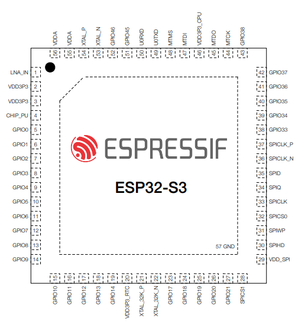

### ESP32-S3



ESP32-S3 consist of 57 pins. (1~57)

Pins consist of these structure

  - IO pins<br>
    ```
    - IO MUX and GPIO functions <- Each IO pin has predefined these
    - RTC functions             <- Some IO pins
    - Analog functions          <- Some IO pins
    ```
  - Analog pins (that have exclusively-dedicated)
  - Power pins

<br>

<strong>Analog</strong><br>
> pin 01: LNA_IN<br>
  pin 04: CHIP_PU<br>
  pin 53: XTAL_N<br>
  pin 54: XTAL_P

<br>

<strong>Power</strong><br>
> pin 02: VDD3P3<br>
pin 03: VDD3P3<br>
pin 20: VDD3P3_RTC<br>
pin 29: VDD_SPI<br>
pin 46: VDD3P3_CPU<br>
pin 55: VDDA<br>
pin 56: VDDA<br>
pin 57: GND

<br>

<strong>IO MUX</strong><br>
> Rest pins<br><br>
> USB OTG
> - pin 25: gpio 19 / USB_D-
> - pin 26: gpio 20 / USB_D+ - USB_PU -> Have to be changed, I am using for matrix keyboard now
>
><br>
>
> UART
> - pin 49: gpio 43 / TX (U0TXD)
> - pin 50: gpio 44 / RX (U0RXD)

 <br>


Power-UP Glitches on Pins
> pins: gpio 1~14, 17~20, XTAL_32K_P, XTAL_32K_N<br>

<br>

<strong>GPIO restriction</strong>
> - pin 5: gpio 0 - Chip boot mode
> - pin 8 : gpio 3 - JTAG signal source
> - pin 25, 26: gpio 19, gpio 20 - USB OTG
> - pin 28, 30, 31, 32, 33, 34, 35: gpio 26, gpio 27, gpio 28, gpio 29, gpio 30, gpio 31, gpio 32 - About SPI (Red)
> - pin 38, 39, 40, 41, 42 - gpio 33, gpio 34, gpio 35, gpio 36, gpio 37 - For SPI (Orage)
> - pin 44, 45, 47, 48 - gpio 39, gpio 40, gpio 41, gpio 42 - For JTAG debug (green)
> - pin 49, 50 - gpio 43, gpio 44 - TX, RX (UART)
> - pin 51 - gpio 45: VDD_SPI voltage
> - pin 52 - gpio 46: Chip boot mode, ROM message printing

<br>

<strong>Pins not in devkitc</strong>

  - Some pins are not in devkit although they are not restricted or not connected to specific function
  > - gpio 22 ~ 25: They are not in ESP32-S3 chip datasheet. They may not exist originally. They are used in another specific functions maybe... I have to check this.
  > - gpio 33: not used for specific functions. but does not exist
  > - gpio 34: not used for specific functions. but does not exist
  >> - Not answer but can be reference: https://docs.espressif.com/projects/esp-idf/en/v5.3/esp32s3/api-reference/peripherals/gpio.html
  >> - It says octal flash or octal PSRAM use gpio 33~37 for SPI such as R8, R8V (but, I am using N8R2, N16R8 devkitc. Maybe N8 is also using gpio 33~37 for SPI?)
  >> - And also said like this: USB-JTAG: GPIO19 and GPIO20 are used by USB-JTAG by default. If they are reconfigured to operate as normal GPIOs, USB-JTAG functionality will be disabled.
  >> - Then, if I can debug USB JTAG with gpio 19, 20, I think I can use gpio 39~42.
  >> - I have to check this for sure. (Descriptions in datasheet and homepage are different. I need to check and ask questions to esp-idf or email....)